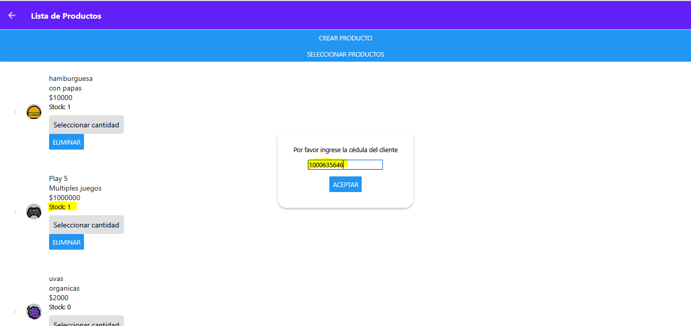

## Español
## App con react-native
Este proyecto ha sido desarrollado con React Native y Expo, e integrado con Firebase de Google para la gestión de datos. 
Es una aplicación multiplataforma, compatible tanto con dispositivos móviles como con la web. La aplicación implementa un sistema CRUD para la administración de clientes y productos, 
permitiendo a los usuarios registrarse e iniciar sesión para realizar compras. Cada transacción genera una factura, la cual puede enviarse por correo electrónico. 
Además, la plataforma gestiona diferentes roles de usuario, incluyendo administrador general, administrador de productos, administrador de clientes y cliente, 
asegurando un control adecuado sobre las operaciones del sistema.

## English
## App with react-native
This project has been developed with React Native and Expo, and integrated with Google's Firebase for data management.
It is a cross-platform application, compatible with both mobile and web devices. The application implements a CRUD system for customer and product management,
allowing users to register and log in to make purchases. Each transaction generates an invoice, which can be sent via email.
In addition, the platform manages different user roles, including general administrator, product administrator, customer administrator, and customer,
ensuring proper control over the system's operations.

## operation in more detail:

## Main login
This is the main screen of the application, where users can log in as long as they are registered. Additionally, exclusive access is offered for administrators through the 'Administrator' 
button, which redirects to a specific login screen (login_administrador). By authenticating using this option, the user gains full access to all the system's functionalities, without role 
restrictions. To use this administrative login, it is necessary to enter a security key previously defined in the code.

## home_administrator

We have three main buttons:

Customers: This button allows you to perform various actions on registered customers. You can create new customers, update existing data, delete records and view the list of previously 
registered customers.

Products: From this button, you can add new products, view the list of available products and select those you wish to purchase. In addition, you can assign the ID of the person who 
will make the purchase to add the selected products to a cart. Later, you will have the option to confirm or reject the purchase. When you confirm the purchase, 
an invoice will be generated, which can be automatically sent to an email.

Buy: This button redirects you directly to the section where you can select the products for your purchase.

## Customers

## Products

It must be taken into account that there is stock available to proceed with the purchase

## purchase invoice

## Sending invoice to the email

## Roles

There are four roles in the system, each with different access permissions and functionality:

Role 0: Full Administrator: This role has full access to the system, including all permissions required to add, update, and delete both customers and products.

Role 1: Customer Administrator: Users with this role have the ability to manage customers, but cannot modify or delete products. 
However, they do have permission to make purchases in the system.

Role 2: Product Administrator: This role is limited to product management. Users can add, update, or delete products, 
but do not have access to modify or manage customers.

Role 3: Customer: This is the role assigned to end customers. Users with this role can only purchase products, 
after they have created an account and logged into the system.

## Role 0

## Role 1

## Role 2

## Role 3

## Restrictions and functionality
In order for a client to log into the system, they must be marked as active and have a role assigned to them. This action can be performed by the Full Administrator or 
the Client Administrator from their profile. To do so, they must access the client list and update the role field, assigning one of the four previously defined roles, 
as well as activate the user.

By default, when a client registers from scratch, their account will be saved as inactive and without an assigned role, which prevents access until the administrator makes 
the necessary changes.

If desired, it can be modified without any problem from the database.

Finally, you must take into account making the Firebase connection correctly within the "firebase.js" file, 
and in the other files where the connection is used.

